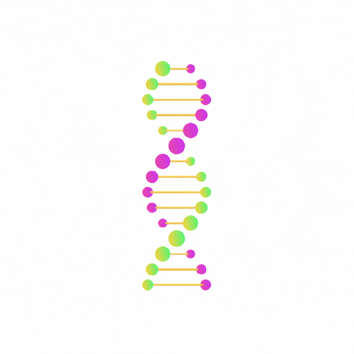

#  DNA-Sequence-Classifier 
---
<!-- PROJECT LOGO -->
<br />
<p align="center">
  <a href="https://github.com/kanishksh4rma/Brain_Tumour_detection_using_MRI_Scans">
    
  </a>
  <!-- INTRODUCTION -->

<!-- ABOUT THE PROJECT -->
## About The Project

The completion of the human genome project in the last decade has generated a strong demand in computational analysis techniques in order to fully exploit the acquired human genome database. The human genome project generated a perplexing mass of genetic data which necessitates automatic genome annotation. There is a growing interest in the process of gene finding and gene recognition from DNA sequences. In genetics, a promoter is a segment of a DNA that marks the starting point of transcription of a particular gene. Therefore, recognizing promoters is a one step towards gene finding in DNA sequences. 

In this project, We have designed and developed a machine learning model for DNA sequence classification based on presence of promoter sequence using various machine learning algorithms. 

---

### Libraries used : 

```
  * sklearn
  * pandas
  * numpy
  *matplotlib
  
```
---

## Algorithms Used

> * KNeighborsClassifier
> * GaussianProcessClassifier
> * DecisionTreeClassifier
> * RandomForestClassifier
> * MLPClassifier
> * AdaBoostClassifier
> * Gaussian Naive Bayes
> * Support Vector Machine

---
<!-- GETTING STARTED -->
## Getting Started

This is an example of how you may set up your project locally.
To get a local copy up and running follow these simple steps.

### Installation

1. Clone the repo
   ```sh
   git clone https://github.com/kanishksh4rma/DNA-Sequence-Classifier.git
   ```
2. Run the DNA Classification code.ipynb file
                                 
---

[](https://sachincpu.github.io/DNA-Classification)

{"mode":"full","isActive":false}